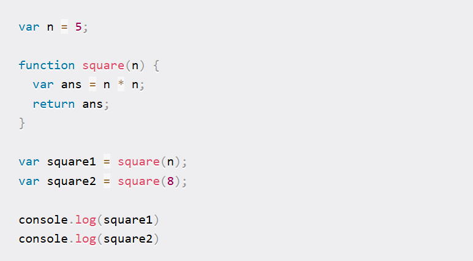
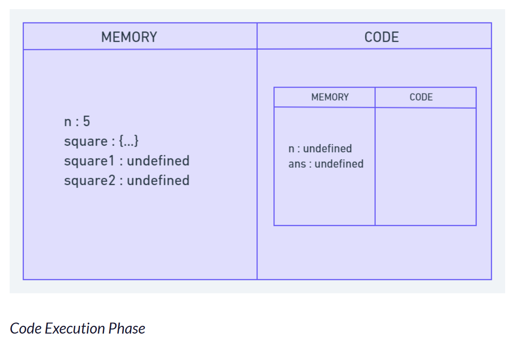
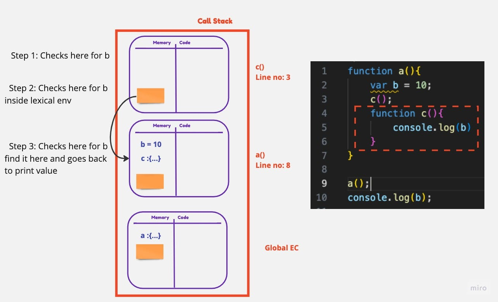
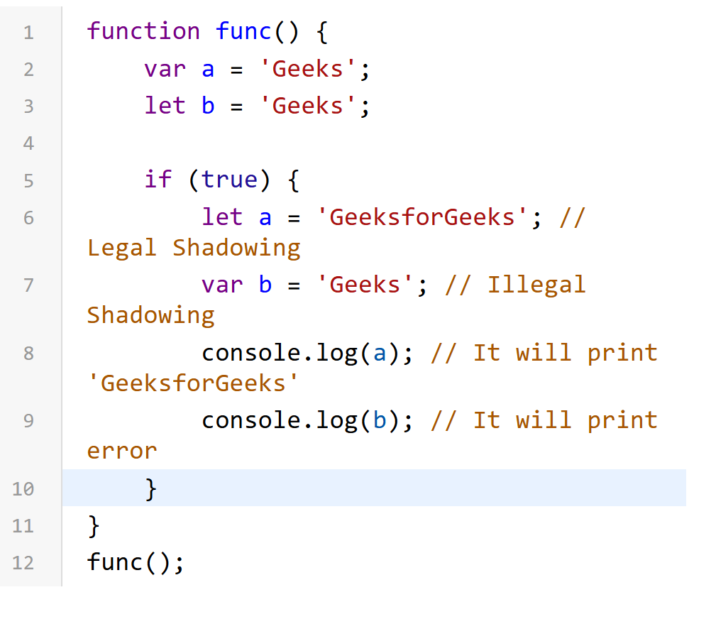

Hi, these are set of questions which were given priority in interviews.
For example of each topic please refer Example.js.

<h1>Var/ Let/ Const  </h1>

->Scope of variables -> functional,Global / block / block

->Redeclaration and reassignment - redeclared and reassigned / cannot be re-declared but reassigned / neither declared nor reassigned

-> Hoisting - Can be Hoisted / Cannot ,stay in TBZ till initialized / cannot , stay in TBZ

-> Window object -> attached to window object, can be accessed using this,window object / Not attached,accessed / Not attached, accessed

       Note : 1) level of strictness -> Const >>> Let >>> Var
              2) Use const wherever possible , followed by let & var the least
              3) const variable declaration and initialisation must be done on the same line.

<h1> Hoisting  </h1>

1.  Hoisting allows you to use functions and variables before they're declared

2.  In MEMORY ALLOCATION PHASE

           Variable declarations are scanned and allocated memory, initialized with the value 'undefined'.

           Function declarations are scanned and stored in memory with their entire code.

3.  Arrow functions enact as variables and get "undefined" during the memory creation phase while functions actually get run.

<h1> Hoisting  </h1>

1) Function bundled with its lexical environment is known as a closure. 

2) Closures help retain references to variables that would otherwise be lost after the execution of the outer function.

<h1> Closures </h1>

1) Function bundled with its lexical environment is known as a closure. Whenever function is returned, even if its vanished in execution context but still it remembers the reference it was pointing to

2) Closures can also be used for data hiding and encapsulation. So other code cannot access this value.

            uses of closures : a) curring
                               b) memoize
                               c) setTimeout
                               d) function like once

                disadvantage : a) memory consumption is high (thus difficulty for garbage collection)

      

<h1> Execution Context / Call Stack  </h1>

Everything in JavaScript happens inside an "execution context".

Execution context has two component

       a) Memory component[variable environment]
         This is the place where all variables and functions are stored as key value pairs. eg-{key: value ||  n:2;}

       b) Code component[Thread of execution]
         This is the place where code is executed one line at a time

1.  When JavaScript code is executed, Execution Context is created and it is called Global Execution Context.

2.  JavaScript program is executed in TWO PHASES inside Execution Context

           a) MEMORY ALLOCATION PHASE - JavaScript program goes throughout the program and allocate memory of Variables and Functions declared in program.

           b) CODE EXECUTION PHASE -  JavaScript program now goes throughout the code line by line and execute the code.

3.  A Function is invoked when it is called and it acts as another MINI PROGRAM and creates its own Execution Context.

4.  Returns keyword return the Control back to the PREVIOUS Execution-Context where the Function is called and Execution Context of the Function is DELETED.

5.  CALL STACK maintains the ORDER of execution of Execution Contexts. It CREATES Execution Context whenever a Program starts or a Function is invoked and it pops out the Execution Context when a Function or Program ENDS.

<h1> Lexical Environment / Scope Chain </h1>

1. Scope of a variable is directly dependent on the lexical environment.

2. Whenever an execution context is created, a lexical environment is created. Lexical environment is the local memory along with the lexical environment of its parent. Lexical as a term means in hierarchy or in sequence.

3. Having the reference of parent's lexical environment means, the child or the local function can access all the variables and functions defined in the memory space of its lexical parent.

4. The JS engine first searches for a variable in the current local memory space, if its not found here it searches for the variable in the lexical environment of its parent, and if its still not found, then it searches that variable in the subsequent lexical environments, and the sequence goes on until the variable is found in some lexical environment or the lexical environment becomes NULL.

5. The mechanism of searching variables in the subsequent lexical environments is known as Scope Chain. If a variable is not found anywhere, then we say that the variable is not present in the scope chain.

<h1> Block Scope  </h1>

1. Code inside curly bracket is called block.

2. Multiple statements are grouped inside a block so it can be written where JS expects single statements like in if, else, loop, function etc.

3. Block values are stored inside separate memory than global. They are stored in block. (the reason let and const are called block scope)

<h1> Temporal Dead Zone  </h1>

1. A temporal dead zone (TDZ) is the time where a variable is inaccessible until the moment the computer completely initializes it with a value.

2. Whenever you try to access a "let" or "const" variable in the temporal dead zone, then it will always give you reference error.

<h1> Window Object  </h1>

1.  window object is created by the JS engines of the respective browsers when global execution context is created.
    It contains the various methods and properties that we can use to access and manipulate the current browser window

             ex -> Windows.setTimeout() , Windows.console , Windows.sessionStorage

2.  A window for a given document can be obtained using the document.defaultView property.

3.  At global level "This" points to Window Object

          ex-> let a =10;
               console.log(a);          //output=10
               console.log(window.a);   //output=10
               console.log(this.a);     //output=10

<h1> Callback  </h1>

Callbacks are the functions passed to another function as an argument and it helps to write asynchronous operation in JS.

3 ways to create Callback

           a) Pass as a parameter to another function
           b) Callback as an Anonymous function
           c) Callback as an ES6 Arrow function

<h1> Callback Hell </h1>

When we are using callbacks, we face two issues:

1. Callback hell - When we have multiple dependent callbacks it will form nested callbacks, code will be unmaintainable and unreadable. This nested callback structure is also called Pyramid of Doom.

2. Inversion of control - We pass the callback function within another function, we are blindly trusting where we don't know whether that function will ever execute our callback function or not, it's so risky for a developer. We loose the control of our program.

 <h1> Promises </h1>

1.  Before promise we used to depend on callback functions which would result in ->

         a) Callback Hell (Pyramid of doom)  
         b) Inversion of control

2)  Inversion of control is overcome by using promise.

    2.1) A promise is an object that represents eventual completion/failure of an asynchronous operation.

    2.2) A promise has 3 states: pending | fulfilled | rejected.

    2.3) As soon as promise is fulfilled/rejected => It updates the empty object which is assigned undefined in pending state.

    2.4) A promise resolves only once and it is immutable.

    2.5) Using .then() we can control when we call the cb(callback) function.

           Before Promise ->

                             createOrder(cartItem, function(orderId){
                               createPayment(orderId)
                             })

           After Promise ->

                             let promise = createOrder(cartItem)

                             promise.then(function(orderId){
                               createPayment(orderId)
                             })

<h1> Promises Chaining </h1>

1. To avoid callback hell (Pyramid of doom) => We use promise chaining. This way our code expands vertically instead of horizontally. Chaining is done using '.then()'

2. A very common mistake that developers do is not returning a value during chaining of promises. Always remember to return a value. This returned value will be used by the next .then()

<h1> Shallow Copy Vs Deep Copy  </h1>

shallow copy -> new object reference to original memory location, original value is modified

     Method-1) using assignment(=) operator

deep copy -> new object at different memory location is created ,original value is not modified

     Method-1) using JSON.parse(JSON.stringify()
     Method-2) Using Spread Operator 
     Method-3) Using Object.assign()

<h1> Call/Apply/Bind </h1>

All these methods are user for method/functions borrowing/sharing.

1. call method is used to invoke the function directly and sets "this" to the first argument and remaining argument can be passed individually.

2. apply method is similar to call method, the only difference is that instead of passing argument individually,
   we will pass the argument in a list/array.

3. bind method is similar to call method. It is also used to override this value,
   but the difference is it will not invoke the function instantly but return a function with attached "this" and arguments which can be called later. 
   Bind is used to create polyfill for a function. Also used for curring.

<h1> Currying </h1>

Currying is a functional programming technique where a function with multiple arguments is transformed into a series of functions,
each taking a single argument.

    Method-1) using closures
    Method-2) using bind function

-> Why is Currying useful in JavaScript?

Helps Create Higher Order Fuction / Code more readable / Reduces chances of error

<h1> Polyfill </h1>

A polyfill is a piece of code (usually JavaScript on the Web) used to provide modern functionality on older browsers that do not natively support it.

common use case

        Ex-1) Array.prototype.includes()
        Ex-2) Function.prototype.bind()
        Ex-3) Math.trunc()
        Ex-4) Object.assign()

 <h1> Debouncing vs Throttling </h1>

Debouncing -> the function is only executed after a specific delay since the "last event's occurrence".
If new events occur within the delay period, the timer is reset, and the function execution is further delayed

        use case : ideal when you want to wait for a pause in the events before triggering a function,
                   like search suggestions

Throttling -> function is executed at a "fixed interval" .
Even if the triggering event occurs more frequently, the function is invoked according to the defined interval.

        use case : suitable for scenarios where you want to limit the frequency of function calls,
                   like handling scroll events or resizing events

<h1> Tree Shaking in JS</h1>

Tree shaking is a term commonly used within a JavaScript context to describe the removal of dead code.

It relies on the import and export statements to detect if code modules are exported and imported for use between JavaScript files.

In modern JavaScript applications, we use module bundlers (e.g., webpack or Rollup) to automatically remove dead code when bundling multiple JavaScript files into single files. This is important for preparing code that is production ready, for example with clean structures and minimal file size.

<h1> Why function called first class citizen ? </h1>

Functions can be ->

     a) assigned to a variable  
     b) passed as an argument  
     c) return as a value  
     d) used as a property in object  
     e) used as item in arrays

<h1> Shadowing in JS</h1>

when a variable is declared in a certain scope having the same name defined on its outer scope and when we call the variable from the inner scope, the value assigned to the variable in the inner scope is the value that will be stored in the variable in the memory space. This is known as Shadowing or Variable Shadowing.

<h1> Set Timeout </h1>

1. setTimeout stores the function in a different place and attached a timer to it, when the timer is finished it rejoins the call stack and executed.

2. Without closure the var reference gives the latest value as it does not retain the original value but rather has the reference so any update in value after timeout will be shown.

3. If we use let/const because they have block scope, every time a new copy of variable is attached, thus this can be done without closure.
