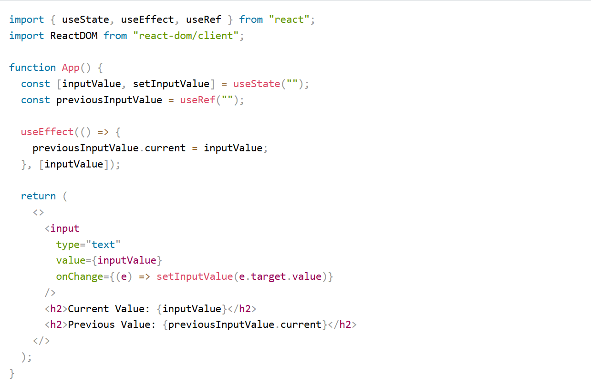
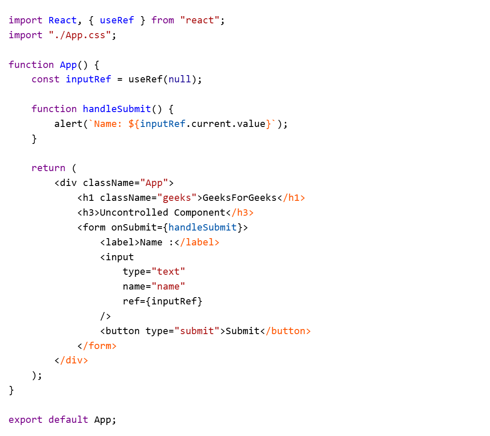
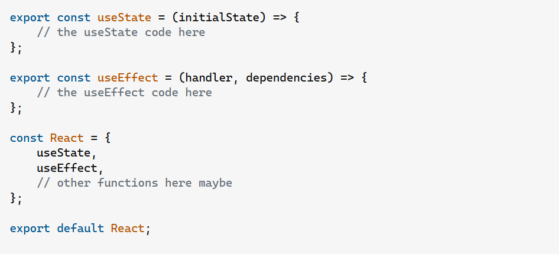

<h1> 1) Hooks with Example. </h1>

 Hooks are functions that let us “hook into” React state and lifecycle features from a 
functional component. 

React hooks were introduced in the 16.8 version of React. Previously, functional components were called 
stateless components. Only class components were used for state management and lifecycle methods. 

The need to change a functional component to a class component, whenever state management or 
lifecycle methods were to be used, led to the development of Hooks.  

<h1> 1.1)  useState </h1>
 Manages state in functional components.  

useState accepts an initial state and returns two values:  

-> The current state. 
-> A function that updates the state.

<h1> 1.2)  useEffect </h1>
Handles side effects in functional components.  

The useEffect hook can be used to mimic the behavior of class component lifecycle methods, such as componentDidMount, componentDidUpdate, and componentWillUnmount

useEffect(() => {

    // Side effect logic goes here

    return () => {

         // Cleanup logic (optional)

    };

}, [dependencies]);

Case a) useEffect as componentDidMount

Case b) useEffect as componentDidUpdate

Case c) useEffect as componentWillUnmount

<h1> 1.3)  useContext </h1>

Accesses the context in functional components.

<h1> 1.4)  useMemo </h1>

Memoizes values to optimize performance.

<h1> 1.5)  useCallback</h1>

Memoizes callback functions to prevent unnecessary renders.

<h1> 1.6)  useReducer </h1>

Manages complex state logic with a reducer function.

<h1> 1.7)  useRef </h1>

The useRef hook in React is a powerful tool that allows you to persist values between renders without causing a re-render.

<h3>case a)  It is particularly useful for accessing and manipulating DOM elements directly. </h3>

<h3>case b)Persisting Value across re-renders.</h3>

<h1> 2) Higher Order Components (HOC) </h1>

What?: Functions that take a component and return an enhanced version.

When?: Reuse component logic, share code, or manipulate component behavior.

Why?: Promotes code reusability and separation of concerns.

How?: Wrap a component with a function that adds or modifies its behavior.

<h1> 3) Life Cycle Methods of Components </h1>

The React lifecycle is divided into three main phases:

Initialization phase: This is the stage where the component is constructed with the given Props and default state. This is done in the constructor of a Component Class.

<h1> 3.1) Mounting phase </h1>

 This phase begins when a component is created and inserted into the DOM.

a) constructor -> Method to initialize state and bind methods. Executed before the component is mounted.

b) static getDerivedStateProps -> Used for updating the state based on props. Executed before every render.

c) render() -> Responsible for rendering JSX and updating the DOM.

d) componentDidMount() -> This function is invoked right after the component is mounted on the DOM i.e.
   this function gets invoked once after the render() function is executed for the first time

<h1> 3.2) Updating Phase </h1>

This occurs when a component is re-rendered due to changes in props or state.

a) getDerivedStateFromProps -> getDerivedStateFromProps(props, state) is a static method that is called just before render() method in   both mounting and updating phase in React.

b) setState() Function -> This is not particularly a Lifecycle function and can be invoked explicitly at any instant. This function is used to update the state of a component. 

c) shouldComponentUpdate() -> shouldComponentUpdate() is invoked before rendering an already mounted component when new props or states are being received. If returned false then the subsequent steps of rendering will not be carried out. 

d) getSnapshotBeforeUpdate() Method -> The getSnapshotBeforeUpdate() method is invoked just before the DOM is being rendered. It is used to store the previous values of the state after the DOM is updated.

e) componentDidUpdate() -> this function is invoked after the component is rerendered i.e. this function gets invoked once after the render() function is executed after the updation of State or Props.

<h1> 3.3) Unmounting Phase </h1>

This is the final phase when a component is removed from the DOM.

a) componentWillUnmount() -> this function gets invoked once before the component is removed from the page and this denotes the end of the lifecycle.

<h1>  Reconciliation & Diffing Algorithm </h1>

Reconciliation is a process that occurs between the two phases of rendering. It covers how the virtual DOM gets synced with the real DOM.

On initial render, the code written in our components gets translated into React elements and mounted onto the DOM. However, React quickly generates a new tree of elements when an update occurs.

Next, it has to sync the virtual DOM containing the new tree with the actual DOM. It will be inefficient to re-render the actual DOM, as the process is quite costly.

So, React compares the trees and finds the least number of operations to transform one tree into another using what is known as the Diffing Algorithm.
 It tries to differentiate the trees to update only to the affected nodes in the real DOM.

<h1>  Prop Drilling </h1>
Sometimes while developing React applications, there is a need to pass data from a component i.e.
higher in the hierarchy to a component that is deeply nested. To pass data between such components, 
we pass props from a source component and keep passing the prop to the next component in the 
hierarchy till we reach the deeply nested component.  

Disadvantage :  The components that should otherwise be not aware of the 
data have access to the data 

<h1> why are useState,useEffect imported in {} in React.</h1>

When importing, javascript sees two things:

1 - Named properties (variables marked with export)

2 - Default export - single variable or function that is exported. in this case, an object containing the two functions above

Named properties are imported using {}, while the default export does not use {}

<h1> Controlled Vs Uncontrolled Component </h1>

<h3>Controlled Component :</h3> Here form data is handled by React Component State

<h6>State Manipulation :</h6> The Value of the input field is controlled by React State (useState or this.state in class component)
<h6>Event Handler :</h6> Changes to the input field(like typing into a text field) are handled by React event handler(onChange, OnBlur, etc)

 <input
  name="name"
  value={name}
  onChange={(e) => setName(e.target.value)
 }

<h3>UnControlled Component</h3> Here form data is handled by DOM itself.

<h6>Direct DOM Manipulation :</h6> The Value of the input field is controlled by DOM (Documenr.getElementById)
<h6>Event Handler :</h6> Changes to the input field(like typing into a text field) are handled by DOM events (onChange, OnBlur, etc)

 <input
  type="text"
  name="name"
  ref={inputRef}
 />

<h1>  State management (all about data) </h1>
<h1>  Redux or Zustand: </h1>
<h1>  Custom Hooks: </h1>
<h1>  Lazy Loading: </h1>
<h1>  Virtual DOM: </h1>
<h1>  SSR vs CSR (important): </h1>
<h1>  Routing (Role-based access control-RBAC): </h1>
<h1>  Testing: </h1>

<h1>  Async Tasks:</h1>
<h1>  Reusability, Readability, modularity, testability (Coding Practices) </h1>
<h1>  Styling: </h1>