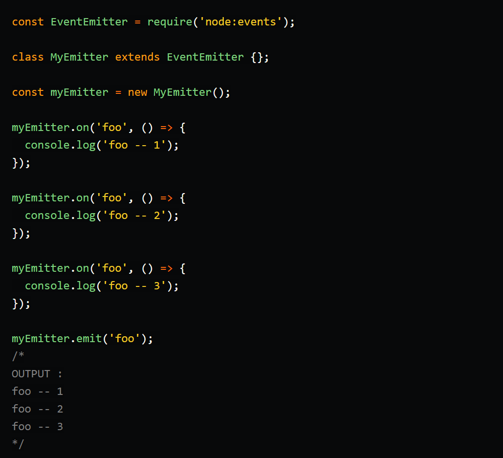
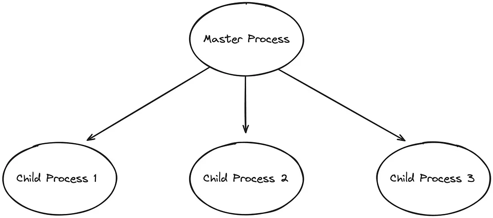

<h1> 1) Event Loop  </h1>

The event loop is what allows Node.js to perform non-blocking I/O operations — despite the fact that a single JavaScript thread is used by default — by offloading operations to the system kernel whenever possible.

<h1> 2) Streams </h1>

-> Used to handling I/O operations( data processing, manipulation, and transfer )
-> Streams are a powerful feature that allows handling data in chunks rather than loading it all at once.

           const stream = require('stream');

Time Efficient: We don’t have to wait until entire file has been transmitted. We can start processing data as soon as we have it.
Memory Efficient: We don’t have to load huge amount of data in memory before we start processing.

4 types -> a) Readable, Writable, Duplex , Transform

<h1> 3) Middleware</h1>

Middleware is a request handler that allows you to intercept and manipulate requests and responses before they reach route handlers. They are the functions that are invoked by the Express.js routing layer.

app.get(path, (req, res, next) => {}, (req, res) => {})

Middleware functions take 3 arguments: the request object, the response object, and the next function.

The middle part (req, res, next)=>{} is the middleware function.
Here we generally perform the required actions before the user can view the webpage or call the data and many other functions.

Types ->

a) Application-level middleware
b) Router-level middleware
c) Error-handling middleware
d) Built-in middleware
e) Third-party middleware

<h1> 4) Require vs Import</h1>

1. require: The CommonJS Syntax. It is used to import modules from external files and libraries. Here's an example:

              const fs = require('fs');

Key characteristics of require:

->Synchronous: The require function is synchronous, meaning it blocks other operations until the module is loaded.  

->Default exports: The require function imports the module's default export. 

->Caching: Once a module is required, Node.js caches it, so subsequent require calls return the same instance. 

2. import: The ECMAScript Module Syntax( a more modern and standardized approach to module imports)

              import  readFile  from 'fs';

Key characteristics of import:

->Asynchronous: The import statement is asynchronous, allowing other operations to run while the module is being fetched. 

->Named exports: The import syntax allows for importing specific functions or variables from a module using named imports. 

->No caching: Unlike require, the import statement doesn't cache modules, resulting in a fresh instance every time it is imported. 

<h1> 5) Event Emitter</h1>

Event emitters are objects which keep track of events and all the functions attached to it. Whenever a event is emitted all the functions attached to that particular events are emitted synchronously. 

 

EventEmitter object exposes two function .on() and .emit(). We can attach multiple functions to the same event and they are called synchronously one by one in the order they were registered.

<h1> 6) microservices</h1>

Microservices architecture is a smart way to design applications by breaking them into smaller, independent components—microservices—each focusing on a specific task.

These microservices operate autonomously, allowing for independent development, deployment, and scaling.

<h1> 7) Throttling</h1>

API Throttling is a technique used to control the amount of data that an app or user can request from your API.

Unlike rate limiting, which controls the number of requests, throttling controls the amount of data over a period of time.
This is usually implemented as a number of requests per minute/hour/day.

       Benifits :- Preventing Server Overload 
                   Fair Usage 
                   Cost Control

<h1> 8) Rate Limiting</h1>

Rate limiting is a technique used to control the amount of incoming or outgoing traffic within a network. 

express-rate-limit is a middleware for Express.js applications that helps control the rate at which requests can be made to the server. 

       Algorithms :- Token Bucket Algorithm
                     Fixed Window Algorithm
                     Sliding Windows Algorithm
                     Leaky Bucket Algorithm

       Benifits :- Preventing abuse 
                   Fair resource allocation 
                   Security against brute-force attacks 
                   Defending against DDoS attacks 
                   Cost efficiency

<h1> 9) access token vs refresh token</h1>

<h1> 10) fork vs spawn</h1>

Both spawn() and fork() are part of the child_process module in Node.js, which provides various methods to create and control child processes. 

                   const { spawn, fork } = require('child_process');

Definition-> 

spawn method launches a new process with a given command

       child_process.spawn(command[, args][, options])

child_process.fork method is a special case of spawn() to create Node processes.
      
       child_process.fork(modulePath[, args][, options])

USECASE -> 

Spawn is useful when you want to make a continuous data transfer(Streaming) in binary/encoding format — e.g. transferring a 1 Gigabyte video, image, or log file. 
Fork is useful when you want to send individual messages — e.g. JSON or XML data messages.

V8 Engine -> 

Spawn-> No new V8 engine instance is created. 
Fork -> New V8 instance is created.

<h1> 11) cluster</h1>

By default, Node.js is single-threaded, which means it runs on a single CPU core. Clustering provides a way to run multiple instances of a Node.js

With clustering, you can create multiple instances of the NodeJS process, known as workers, each running on a separate CPU core and share the same port number.

 

Working->

Master Process: The main Node.js process (master) forks multiple child processes (workers), each running a copy of the Node.js application.

Worker Processes: Each worker process runs independently and has its own event loop. They share the same server port, and the operating system manages incoming connections, distributing them among the workers.

Inter-Process Communication: The master process can communicate with workers via message passing, enabling the coordination of tasks and resource sharing.

USECASE ->

Clustering is useful when you have a high number of incoming HTTP requests or other I/O-bound tasks.

<h1> 12)</h1>
<h1> 13) libuv</h1>
<h1> 14) web socket</h1>
<h1> 15) JWT Token</h1>
<h1> 16) buffer</h1>
<h1> 17) test pyramid</h1>
<h1> 18) setimmediate vs process.nextTick</h1>

process.nextTick() fires immediately on the same phase

setImmediate() fires on the following iteration or 'tick' of the event loop

<h1> 19) error handling in node</h1>

                    Using try-catch block
                    Using callbacks
                    Using promises and promise callbacks
                    Using async-await

<h1> 20) File system handling / file based operations </h1>

The fs (File System) module in Node.js provides an API for interacting with the file system.

      const fs = require('fs');

Uses ->Read Files/Write Files/Append Files/Close Files/Delete Files

Features -> Asynchronous and Synchronous Methods/Error Handling/Directory Management

