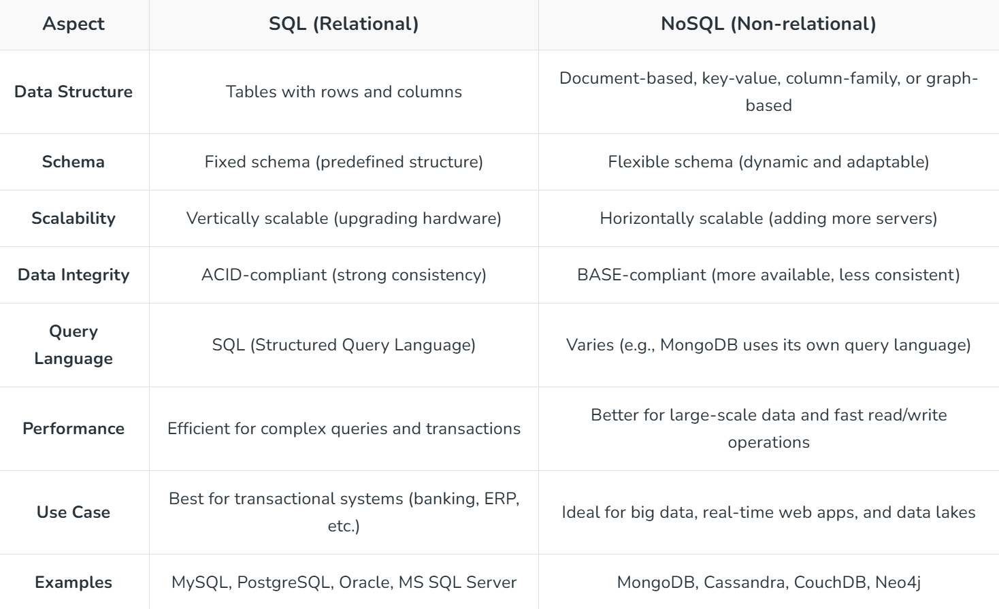

//---------------MONGO DB-----------------//

<h1>1)  SQL vs NoSQL </h1>

<h1>2)  Indexing  </h1>

Indexing is a technique used to speed up data retrieval from a database.

They work similarly to indexes in books, where you can quickly locate information without scanning the entire content.

                Note : Indexes in Mongodb are stored in B-Tree(self-balancing search tree)

How it Works:

1) An index is created on one or more fields of a collection. Once an index is created, MongoDB uses it to speed up the search for documents that match a query condition.

2) Indexes store a sorted list of the indexed field's values along with a reference to the document. This allows MongoDB to quickly locate matching documents without scanning the entire collection.

                db.users.createIndex({ email: 1 });

<h1>3)  Sharding  </h1>

Sharding is a method used to horizontally scale MongoDB by distributing data across multiple servers, known as shards. 

This technique is used when the dataset becomes too large to fit on a single server or when you want to distribute the load among multiple machines to improve performance and availability.

                db.createCollection("users");
                sh.shardCollection("users", { userId: 1 });

<h1>  Replica set  </h1>

 A replica set is a group of MongoDB servers that maintain the same data set. One node is primary, while others are secondary nodes.

The primary node handles all write operations, while secondary nodes replicate the data from the primary node. Replica sets provide data redundancy and high availability.

<h1>  Default port for MongoDB  </h1>
 
The default port for MongoDB is 27017.

<h1>  MongoDB Aggregation Framework  </h1>

The aggregation framework in MongoDB allows you to process data records and return computed results. It’s highly useful for data analysis and reporting. Key operators include:

$match: Filters the data (like SQL WHERE).

$group: Groups the data (like SQL GROUP BY).

$sort: Sorts the data (like SQL ORDER BY).

$project: Shapes the data, including renaming fields and adding computed fields.

$lookup: Joins data from other collections (similar to SQL JOIN).

$unwind: Deconstructs arrays into separate documents.

$limit: Limits the number of returned documents.

Example

                db.orders.aggregate([
                { $match: { status: "shipped" } },
                { $group: { _id: "$customerId", total: { $sum: "$totalAmount" } } },
                { $sort: { total: -1 } }
                ]);

<h1> MongoDB Data Modeling  </h1>

MongoDB is a NoSQL database, and its data modeling differs from traditional relational databases. Here's an overview:

1) Schemas: Although MongoDB is schema-less, it’s still common to define schemas using Mongoose (an ODM for MongoDB). This ensures data consistency and structure.

2) Document Design: MongoDB stores data in documents (BSON format), which can have nested fields and arrays. When designing data models, you need to choose between:

2.1) Embedding Data: Good for one-to-few relationships (e.g., user profile and address). Reduces the number of joins but increases document size.

2.2) Referencing Data: Good for one-to-many or many-to-many relationships. References are stored as object IDs, which helps with normalization.

3)Data Modeling Best Practices:

3.1) Avoid excessive nesting of documents (can lead to large documents and performance degradation).

3.2) Use indexes wisely to optimize query performance.

3.3) Consider sharding when scaling to large datasets.